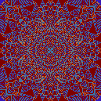

# Fractal Generation using Sandpiles

A sandpile is a (N x N) grid, filled with non-negative integer values. 
A *normalized* sandpile contains no values greater than 3. If a cell contains a value greater than 3, the value 4 is subtracted from it and the value of all neighboring cells is incremented by 1.

```
030    040    202    212
343 -> 404 -> 040 -> 101
030    040    202    212
```
Example fractal with dimension 400 and start value 30000



### Using the Java implementation
Build Main.java
```
cd Java
javac Main.java
```
Run it
```
java Main --dimension <dim> --sand <pile> --path <path>
```
with
```
<dim> : image output will have size <dim>x<dim> (Java/fractal.png)
<pile> : start value of center cell, all other cells are initialized to 0
<path> : image store location (default "fractal.png")
```

### Using the Python implementation
Requires numpy and scipy.misc

### License
```
Permission is hereby granted, free of charge, to any person obtaining a copy
of this software and associated documentation files (the "Software"), to deal
in the Software without restriction, including without limitation the rights
to use, copy, modify, merge, publish, distribute, sublicense, and/or sell
copies of the Software, and to permit persons to whom the Software is
furnished to do so, subject to the following conditions:

The above copyright notice and this permission notice shall be included in all
copies or substantial portions of the Software.

THE SOFTWARE IS PROVIDED "AS IS", WITHOUT WARRANTY OF ANY KIND, EXPRESS OR
IMPLIED, INCLUDING BUT NOT LIMITED TO THE WARRANTIES OF MERCHANTABILITY,
FITNESS FOR A PARTICULAR PURPOSE AND NONINFRINGEMENT. IN NO EVENT SHALL THE
AUTHORS OR COPYRIGHT HOLDERS BE LIABLE FOR ANY CLAIM, DAMAGES OR OTHER
LIABILITY, WHETHER IN AN ACTION OF CONTRACT, TORT OR OTHERWISE, ARISING FROM,
OUT OF OR IN CONNECTION WITH THE SOFTWARE OR THE USE OR OTHER DEALINGS IN THE
SOFTWARE.
```
